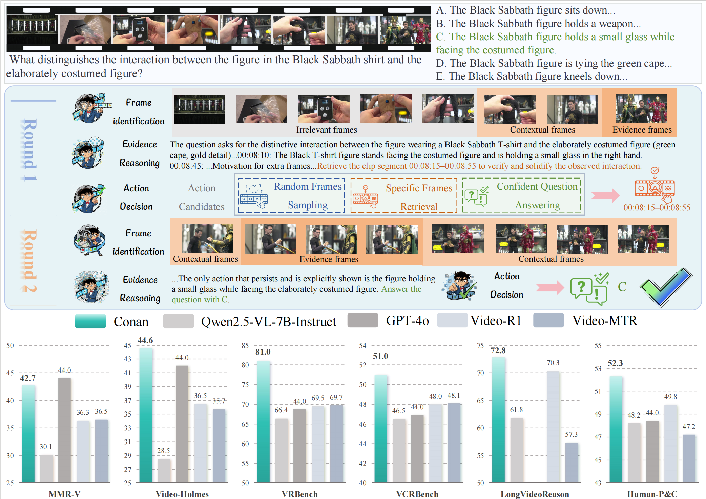

# <div style="text-align: center;"> </div>
# Conan: Progressive Learning to Reason Like a Detective over Multi-Scale Visual Evidence  

## 🔥 Updates

🚀 **October 20, 2025** — We are excited to release [Conan-7B](https://huggingface.co/RUBBISHLIKE/Conan-7B) and its accompanying evaluation toolkit, [Conan-Eval](./Conan-Eval/)!

🚀 **September 30, 2025** — [Conan-SFT-7B](https://huggingface.co/RUBBISHLIKE/Conan-7B-SFT) has officially landed on Hugging Face!

## Introduction
Conan is an innovative Multimodal Large Language Model (MLLM) designed with advanced reasoning capabilities inspired by a detective's investigative process. It excels in:
1.  **Identifying multi-scale frames** of visual evidence.
2.  **Reasoning over cross-frame clues** to connect information.
3.  **Deciding plausible actions** based on its deductions.

**🏆 Performance Highlights**
Here's a glimpse of Conan's impressive capabilities:


## ⚙️ Environment Setup

- Clone the Repository:

```
git clone https://github.com/MCG-NJU/StreamForest.git
cd StreamForest
```

- Create and Activate Environment:
```
conda create --name Conan python=3.10
conda activate Conan
```
- Install Dependencies:
```
pip install torch pandas numpy pillow accelerate transformers sentencepiece decord flash-attn --no-build-isolation
```

## 🏋️ Training (Coming Soon)

The full training pipeline is scheduled for release on **November 15, 2025**. This will include:
*   **Conan-91k Dataset:** Comprising 60K SFT samples and 31K RLVR samples.
*   **Multi-Stage Cold-Start Strategy:** Progressively activating the reasoning capabilities.
*   **Joint Identification–Reasoning–Action RLVR:** Encourage exploring multi-step reasoning traces.

## 📊 Evaluation

**Conan-Eval** toolkit allows for comprehensive evaluation across various benchmarks:

1.  **Multi-step Reasoning Benchmarks:**
    *   [MMR-V](https://mmr-v.github.io/home_page.html)
    *   [Video-Holmes](https://video-holmes.github.io/Page.github.io/)
    *   [VRBench](https://vrbench.github.io)
    *   [VCRBench](https://vlm-reasoning.github.io/VCR-Bench/)
    *   [LongVideoReason](https://huggingface.co/LongVideo-Reason)
    *   [HumanPCR](https://huggingface.co/datasets/HumanPCR/HumanPCR)

2.  **Long-video Understanding Benchmarks:**
    *   [LongVideoBench](https://longvideobench.github.io)
    *   [MLVU](https://github.com/JUNJIE99/MLVU)
    *   [LVBench](https://lvbench.github.io)
    *   [Video-MME](https://video-mme.github.io/home_page.html)

3.  **Usage:**
    To run the evaluation, simply execute:
    ```bash
    bash run.sh
    ```

## Acknowledgments
We extend our sincere gratitude to the following projects for their invaluable contributions and inspiration:
*   [ms-swift](https://github.com/modelscope/ms-swift)
*   [Video-R1](https://github.com/tulerfeng/Video-R1)
*   [Generative-sampler](https://generative-sampler.github.io)

