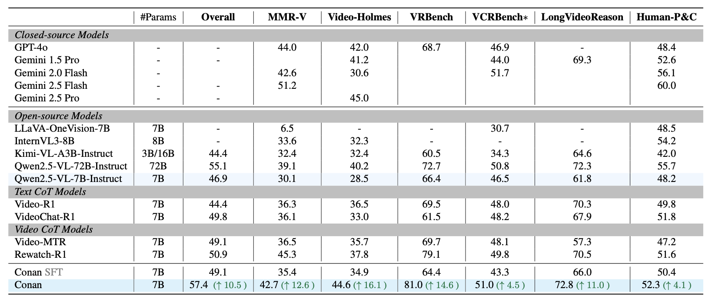

# <div style="text-align: center;"> </div>
# Conan: Progressive Learning to Reason Like a Detective over Multi-Scale Visual Evidence  

📅 Breaking News

🚀 10/20/2025 — We release [Conan-7B](https://huggingface.co/RUBBISHLIKE/Conan-7B), and evaluation toolkit [Conan-Eval](./Conan-Eval/)!

🚀 09/30/2025 — [Conan-SFT-7B](https://huggingface.co/RUBBISHLIKE/Conan-7B-SFT) has landed on Hugging Face!

# Conan
An MLLM empowered by Conan-like reasoning capabilities: 1. Identify multi-scale frames. 2. Reason over cross-frame clues. 3. Decide plausible actions.

🏆 Performance Comparison on Multi-step reasoning


🏆 Performance Comparison on Long-Video Understanding


## 🏋️ Training (Coming Soon)

Full training pipeline will be released on 2025.11.15, including:
Conan-91k Dataset: 60K SFT + 31K RLVR samples,
Multi-Stage Cold-Start Strategy,
Joint Identification–Reasoning–Action RLVR

## Evaluation

**Conan-Eval**

**Setup**

1.  **Environment:** Python 3.8+.
2.  **Install Libraries:**
    ```bash
    pip install torch pandas numpy pillow accelerate transformers sentencepiece decord flash-attn --no-build-isolation
    ```
3.  **Multi-step reasoning benchmarks:** [MMR-V](https://mmr-v.github.io/home_page.html), [Video-Holmes](https://video-holmes.github.io/Page.github.io/), [VRBench](https://vrbench.github.io), [VCRBench](https://vlm-reasoning.github.io/VCR-Bench/), [LongVideoReason](https://huggingface.co/LongVideo-Reason), [HumanPCR](https://huggingface.co/datasets/HumanPCR/HumanPCR).

**Long-video understanding benchmarks:** [LongVideoBench](https://longvideobench.github.io), [MLVU](https://github.com/JUNJIE99/MLVU), [LVBench](https://lvbench.github.io), [Video-MME](https://video-mme.github.io/home_page.html).

**Usage**
    ```bash
    bash run.sh
    ```